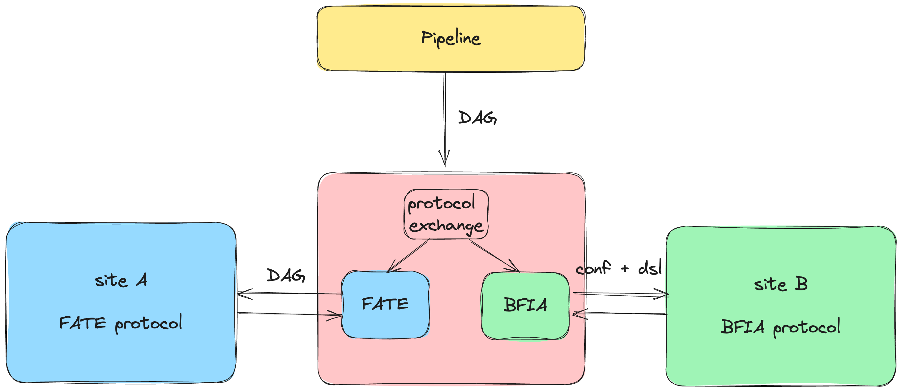
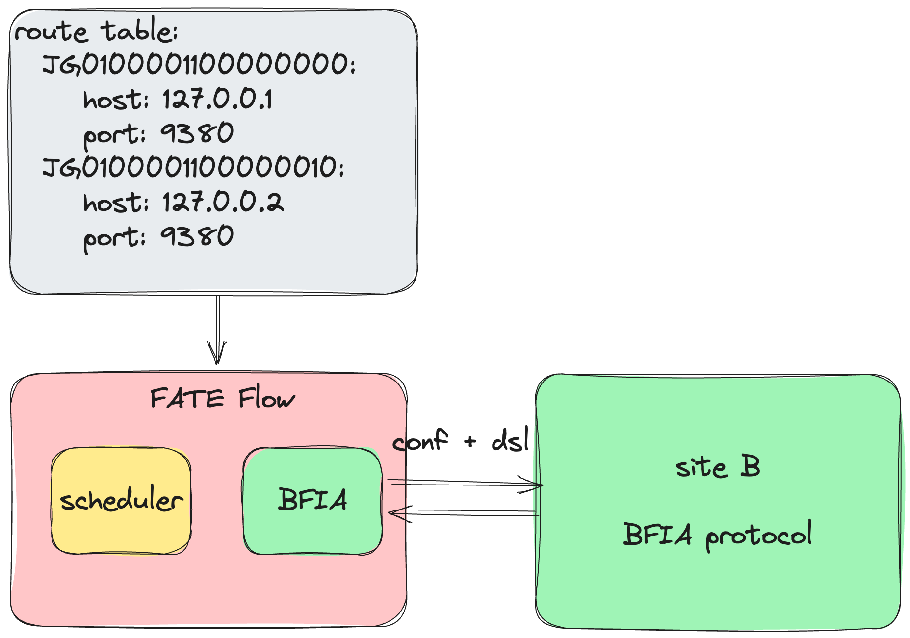

# BFIA Integration Guide

The [BFIA protocol](https://github.com/FederatedAI/InterOp), organized by the Beijing Financial Technology Industry Alliance and led by China UnionPay, is an API interface specification established jointly by over 60 units, including major financial institutions, telecom operators, internet companies, technology firms, testing agencies, and research institutes. FATE 2.0 has adapted this protocol across various layers like Pipeline, Scheduling, Communication, and more. This document will guide how to perform federated learning with FATE framework using the BFIA protocol.

## 1. Pipeline



The pipeline constructs a unified client for FATE's interoperation, generating a DAG configuration based on the FATE 2.0 protocol. The pipeline doesn't directly call the BFIA protocol API; instead, it utilizes the FATE protocol API and transforms it into BFIA protocol execution within the FATE Flow through an adapter pattern.

### 1.1 FATE Algorithm

```python
from fate_client.pipeline import FateFlowPipeline
from fate_client.pipeline.components.fate import CoordinatedLR, PSI
from fate_client.pipeline.interface.channel import DataWarehouseChannel


guest = "JG0100001100000010"
host = "JG0100001100000010"
arbiter = "JG0100001100000010"
pipeline = FateFlowPipeline().set_parties(guest=guest, host=host, arbiter=arbiter)
pipeline.set_site_role("guest")
pipeline.set_site_party_id(guest)

psi_0 = PSI("psi_0",
        input_data=[DataWarehouseChannel(dataset_id="experiment#breast_hetero_guest", parties=dict(guest=guest)),
                    DataWarehouseChannel(dataset_id="experiment#breast_hetero_host", parties=dict(host=host))])
lr_0 = CoordinatedLR("lr_0",
                 epochs=10,
                 batch_size=300,
                 optimizer={"method": "SGD", "optimizer_params": {"lr": 0.1}, "penalty": "l2", "alpha": 0.001},
                 init_param={"fit_intercept": True, "method": "zeros"},
                 train_data=psi_0.outputs["output_data"],
                 learning_rate_scheduler={"method": "linear", "scheduler_params": {"start_factor": 0.7,
                                                                                   "total_iters": 100}})

pipeline.add_tasks([psi_0, lr_0])

pipeline.protocol_kind = "bfia"
pipeline.conf.set(
"extra",
dict(initiator={'party_id': guest, 'role': 'guest'})
)
pipeline.guest.conf.set("resources", dict(cpu=-1, disk=-1, memory=-1))
pipeline.hosts[0].conf.set("resources", dict(cpu=-1, disk=-1, memory=-1))
pipeline.compile()
pipeline.fit()

```

### 1.2 UnionPay Algorithm

```python
from fate_client.pipeline import FateFlowPipeline
from fate_client.pipeline.adapters.bfia.components.unionpay.intersection import Intersection
from fate_client.pipeline.adapters.bfia.components.unionpay.hetero_lr import HeteroLR
from fate_client.pipeline.interface import DataWarehouseChannel


pipeline = FateFlowPipeline().set_parties(
    guest="JG0100001100000010",
    host="JG0100001100000010",
    arbiter="JG0100001100000010"
)
pipeline.set_site_role("guest")
pipeline.set_site_party_id("JG0100001100000010")

intersection_0 = Intersection(
    "intersect_rsa_1",
    id="id",
    intersect_method="rsa",
    only_output_key=False,
    rsa_params=dict(
        final_hash_method="sha256",
        hash_method="sha256",
        key_length=2048
    ),
    sync_intersect_ids=True,
    connect_engine="mesh",
    train_data=[
        DataWarehouseChannel(dataset_id="testspace#test_guest", parties=dict(guest="JG0100001100000010")),
        DataWarehouseChannel(dataset_id="testspace#test_host", parties=dict(host="JG0100001100000010"))
    ]
)

hetero_lr_0 = HeteroLR(
    "hetero_logistic_regression_1",
    id="id",
    label="y",
    batch_size=-1,
    penalty="L2",
    early_stop="diff",
    tol=0.0001,
    max_iter=2,
    alpha=0.01,
    optimizer="nesterov_momentum_sgd",
    init_param={"init_method":"zeros"},
    learning_rate=0.15,
    connect_engine="mesh",
    train_data=intersection_0.outputs["train_data"]
)

pipeline.add_task(intersection_0)
pipeline.add_task(hetero_lr_0)
pipeline.conf.set(
    "extra",
    dict(initiator={'party_id': 'JG0100001100000010', 'role': 'guest'})
)

pipeline.protocol_kind = "bfia"
pipeline.guest.conf.set("resources", dict(cpu=-1, disk=-1, memory=-1))
pipeline.hosts[0].conf.set("resources", dict(cpu=-1, disk=-1, memory=-1))
pipeline.compile()
pipeline.fit()

```

### 1.3 Other BFIA Protocol Algorithms
#### 1.3.1 Pipeline Adaptation Development:
To integrate other algorithms, follow these steps:
- Component Description File: Place the algorithm component description file in [pipeline-component-define](https://github.com/FederatedAI/FATE-Client/blob/v2.0.0/python/fate_client/pipeline/adapters/bfia/component_define)
- Component Definition: Place the algorithm component definition file in [pipeline-component](https://github.com/FederatedAI/FATE-Client/blob/v2.0.0/python/fate_client/pipeline/adapters/bfia/components)

## 2. Scheduling



### 2.1 Modifying Configurations
- Modify [Route-Table](../python/fate_flow/adapter/bfia/conf/route_table.yaml).
- Update [local-site-settings](../python/fate_flow/adapter/bfia/settings.py)
  - `LOCAL_SITE_ID`: ID of the local site.
  - `STORAGE_ADDRESS`: S3 storage address.
  - `TRANSPORT`: Communication engine address used by the local algorithm.
  - `CONTAINER_LOG_PATH`: Local path for container logs.
  - `CALLBACK_ADDRESS`: Address for scheduling service used by the algorithm for callbacks.

### 2.2 Registering Algorithms
```json
{
  "name": "unionpay",
  "device": "docker",
  "version": "2.0.0",
  "metadata": {
    "base_url": "",
    "image": "unionpay:2.0.0"
  },
  "protocol": "bfia",
  "components_description": {}
}
```

Registration Configuration Explanation:
- `name`: Name of the provider/vendor.
- `device`: Mode of algorithm execution, currently supporting "docker".
- `version`: Algorithm version.
- `metadata`: Image information.
- `protocol`: Protocol used by the algorithm.
- `components_description`: Description of algorithm components, reference [BFIA Algorithm Self-description](https://github.com/FederatedAI/InterOp/blob/main/API_SPECS/3.%E7%AE%97%E6%B3%95%E7%BB%84%E4%BB%B6%E5%B1%82%E6%8E%A5%E5%8F%A3/%E9%9A%90%E7%A7%81%E8%AE%A1%E7%AE%97%E4%BA%92%E8%81%94%E4%BA%92%E9%80%9A%E7%AE%97%E6%B3%95%E7%BB%84%E4%BB%B6%E5%B1%82API.md#2-%E7%AE%97%E6%B3%95%E7%BB%84%E4%BB%B6%E8%87%AA%E6%8F%8F%E8%BF%B0%E6%96%87%E4%BB%B6)

#### 2.2.1 Registering FATE Algorithms
```shell
flow provider register -c examples/bfia/fate/register/fate_components.json
```
- Configuration reference: [fate_components.json](../examples/bfia/fate/register/fate_components.json)

#### 2.2.2 Registering UnionPay Algorithms
```shell
flow provider register -c examples/bfia/unionpay/register/unionpay_components.json
```
- Configuration reference: [unionpay_components.json](../examples/bfia/unionpay/register/unionpay_components.json)

#### 2.2.3 Registering Other Algorithms
You can use the above configuration to register algorithm images from other vendors into the FATE Flow service. They will be automatically loaded and run as containers during execution.

## 3. Usage

- Modify configurations as outlined in section 2.1.
- Register corresponding algorithms as described in section 2.2.

### 3.1 Using FATE Algorithm Images

#### 3.1.1 Data Upload

##### 3.1.1.1 Upload

- Install FATE Flow and Flow Cli
```shell
pip install fate_flow==2.0.0
pip install fate_client==2.0.0
```
- Upload data to s3 storage
```python
import os
import tempfile

from fate_flow.adapter.bfia.container.wraps.wraps import DataIo
from fate_flow.components.components.upload import Upload, UploadParam
from fate_flow.entity.spec.dag import Metadata


def upload_data(s3_address, namespace, name, file, meta, head=True, partitions=16, extend_sid=True, storage_engine="standalone"):
    upload_object = Upload()
    params = {
        'name': name,
        'namespace': namespace,
        'file': file,
        'storage_engine': storage_engine,
        'head': head,
        'partitions': partitions,
        'extend_sid': extend_sid,
        'meta': meta
    }
    params = UploadParam(**params)

    with tempfile.TemporaryDirectory() as data_home:
        os.environ["STANDALONE_DATA_HOME"] = data_home
        data_meta = upload_object.run(params).get("data_meta")

        metadata = Metadata(metadata=dict(options=dict(partitions=partitions), schema=data_meta))
        data_path = os.path.join(data_home, namespace, name)
        engine = DataIo(s3_address)
        engine.upload_to_s3(data_path, name=name, namespace=namespace, metadata=metadata.dict())


if __name__ == "__main__":
    s3_address = "s3://127.0.0.1:9000?username=admin&password=12345678"
    file = 'examples/data/breast_hetero_guest.csv'
    namespace = "upload"
    name = "guest"


    meta = {
        "delimiter": ",",
        "label_name": "y",
        "match_id_name": "id"
    }
    upload_data(s3_address=s3_address, namespace=namespace, name=name, file=file, meta=meta)

```
Modify the parameters `s3_address`, `file`, `namespace`, `name`, `meta` in the above code with actual values, where:
```yaml
s3_address: s3 storage address
file: local path of the data
namespace: FATE table namespace
name: FATE table name
meta: Data metadata
```

##### 3.1.1.2 dataframe-transformer

Explanation: The upload process stores data in the s3 storage. FATE algorithms depend on dataframe-format datasets. FATE provides the `dataframe-transformer` component for data conversion. **In the BFIA protocol, the input parameter for data is `dataset_id`, which FATE adapts as `$namespace + '#' + $name`**
- Configuration: [dataframe-transformer](../examples/bfia/fate/job/dataframe_transformer.yaml)
- Replace `JG0100001100000010` in the configuration with the actual site ID
- Modify `dataset_id` to `$namespace + '#' + $name`, where namespace and name are the parameters set for upload.
```yaml
dag:
  tasks:
    transformer_0:
      inputs:
        data:
          table:
            data_warehouse:
              dataset_id: upload#guest
```
- The output data table is defined in dag.tasks.transformer_0.parameters and can be customized.
```yaml
dag:
  tasks:
    transformer_0:
      parameters:
        name: breast_hetero_guest
        namespace: experiment
```
- Submit the `dataframe-transformer` component: `flow job submit -c examples/bfia/fate/job/dataframe_transformer.yaml`

#### 3.1.2 Running FATE Algorithm Components
Jobs can be submitted via CLI, pipelines, or the BFIA's [restful-api](https://github.com/FederatedAI/InterOp/blob/main/API_SPECS/2.%E6%8E%A7%E5%88%B6%E5%B1%82%E6%8E%A5%E5%8F%A3/%E9%9A%90%E7%A7%81%E8%AE%A1%E7%AE%97%E4%BA%92%E8%81%94%E4%BA%92%E9%80%9A%E6%8E%A7%E5%88%B6%E5%B1%82API.md#51-%E5%88%9B%E5%BB%BA%E4%BD%9C%E4%B8%9A)

- Submitting jobs via CLI:
  - Configuration: [psi-lr](../examples/bfia/fate/job/psi_lr.yaml), [psi-sbt](../examples/bfia/fate/job/psi_sbt.yaml)
  - Command: `flow job submit -c examples/bfia/fate/job/psi_lr.yaml`
- Submitting jobs via pipelines: [psi-lr](../examples/bfia/fate/pipeline/test_lr.py), [psi-sbt](../examples/bfia/fate/pipeline/test_sbt.py)
- Using the restful-api: [psi-lr](../python/fate_flow/adapter/bfia/examples/job/fate/fate_psi_lr.json), [psi-sbt](../python/fate_flow/adapter/bfia/examples/job/fate/fate_psi_sbt.json)

### 3.2 Using Algorithm Images from Other Vendors

#### 3.2.1 Data Upload
Each vendor provides its own data upload interface.

#### 3.2.2 Running Algorithm Components from Other Vendors (UnionPay example)
Jobs can be submitted via CLI, pipelines, or the BFIA's [restful-api](https://github.com/FederatedAI/InterOp/blob/main/API_SPECS/2.%E6%8E%A7%E5%88%B6%E5%B1%82%E6%8E%A5%E5%8F%A3/%E9%9A%90%E7%A7%81%E8%AE%A1%E7%AE%97%E4%BA%92%E8%81%94%E4%BA%92%E9%80%9A%E6%8E%A7%E5%88%B6%E5%B1%82API.md#51-%E5%88%9B%E5%BB%BA%E4%BD%9C%E4%B8%9A)

- Submitting jobs via CLI:
  - Configuration: [psi-lr](../examples/bfia/unionpay/job/psi_lr.yaml), [psi-sbt](../examples/bfia/unionpay/job/psi_sbt.yaml)
  - Command: `flow job submit -c examples/bfia/unionpay/job/psi_lr.yaml`
- Submitting jobs via pipelines: [psi-lr](../examples/bfia/unionpay/pipeline/test_unionpay_lr.py), [psi-sbt](../examples/bfia/unionpay/pipeline/test_unionpay_sbt.py)
- restful-api: [psi-lr](../python/fate_flow/adapter/bfia/examples/job/unionpay/bfia_psi_lr.json)、[psi-sbt](../python/fate_flow/adapter/bfia/examples/job/unionpay/bfia_psi_sbt.json)
