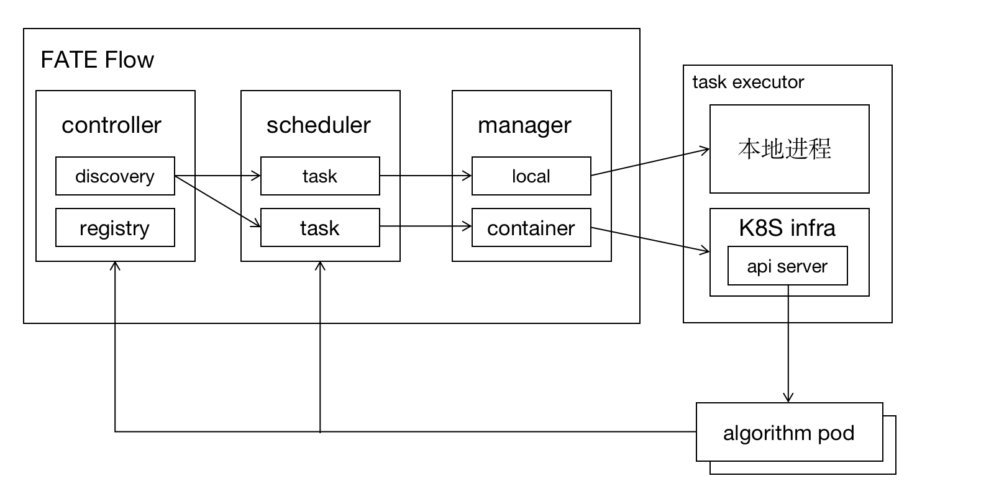
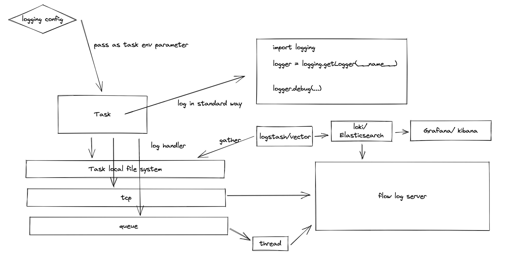

## 算法容器注册与加载方案

### 1. 整体架构图


模块说明：

1. discovery: 算法服务发现和路由
2. registry: 算法注册器，包括本地算法和算法镜像
3. scheduler: 调度器，对任务进行调度
4. local manager: 本地算法任务(非容器化方式)管理
5. container manager: 基于容器化方式的管理，是对底层容器编排能力的封装

### 2. 容器加载
#### 2.1 容器管理器

负责管理组件所运行的容器的管理，与容器平台(如：Docker、Kubernetes等)进行对接，完成容器的编排管理。

#### 2.2 容器运行模式

##### 2.2.1 即用即销毁
说明：一个task对应一个容器
实现方式：通过容器命令接口启动容器任务, 任务运行结束上报其对应状态和相应输出给系统，并销毁当前容器。

##### 2.2.2 常驻服务(待实现)
说明：支持容器复用，多个task运行在一个容器里
实现方式：flow服务内嵌至算法容器中，并暴露相关接口(run、stop等)给调度层。调度层通过容器支持服务接口启动task。容器启动后为常驻服务，供调度层调度。

### 3. 参数传递方式
#### 3.1 环境变量
适用于即用即销毁模式，容器启动时将参数放到算法容器环境变量里。
#### 3.2 接口参数(待实现)
适用于常驻服务模式，启动task的方式为调用容器服务接口，并把所需参数作为接口参数传入。

### 4. 算法注册与加载(待实现)
1. 注册：flow提供镜像注册接口(provider)，内容定义：
```yaml
provider: fate
version: 2.0.0.alpha
way: docker
```
注：provider为算法来源;version为算法版本号;way为算法形式，包括local、docker、kubernetes等
2. 加载：dag配置可指定provider，flow通过provider加载出对应算法模块；

### 5. 容器日志方案

- 文件映射
- 日志接口
- 队列缓存+日志接口
