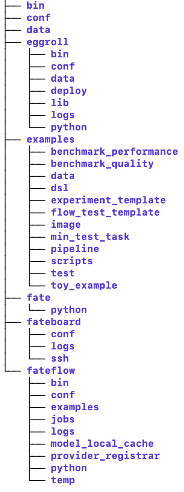

# Document Navigation

## 1. General Document Variables

You will see the following `document variables` in all `FATE Flow` documentation, with the following meanings.

- FATE_PROJECT_BASE: denotes the `FATE project` deployment directory, containing configuration, fate algorithm packages, fate clients and subsystems: `bin`, `conf`, `examples`, `fate`, `fateflow`, `fateboard`, `eggroll`, etc.
- FATE_BASE: The deployment directory of `FATE`, named `fate`, contains algorithm packages, clients: `federatedml`, `fate arch`, `fate client`, usually the path is `${FATE_PROJECT_BASE}/fate`
- FATE_FLOW_BASE: The deployment directory of `FATE Flow`, named `fateflow`, containing `fate flow server`, etc., usually the path is `${FATE_PROJECT_BASE}/fateflow`
- FATE_BOARD_BASE: the deployment directory of `FATE Board`, name `fateboard`, contains `fateboard`, usually the path is `${FATE_PROJECT_BASE}/fateboard`
- EGGROLL_HOME: the deployment directory for `EggRoll`, named `eggroll`, containing `rollsite`, `clustermanager`, `nodemanager`, etc., usually in `${FATE_PROJECT_BASE}/eggroll`

    Deploy the `FATE project` with reference to the main repository [FederatedAI/FATE](https://github.com/FederatedAI/FATE), the main directory structure is as follows

    {: style="height:566px;width:212px"}

- FATE_VERSION: The version number of `FATE`, e.g. 1.7.0
- FATE_FLOW_VERSION: the version number of `FATE Flow`, e.g. 1.7.0
- version: Generally in the deployment documentation, it means the version number of `FATE project`, such as `1.7.0`, `1.6.0`.
- version_tag: generally in the deployment documentation, indicates the `FATE project` version tag, such as `release`, `rc1`, `rc10`

## 2. Glossary of terms

`component_name`: the name of the component when the task is submitted, a task can have more than one of the same component, but the `component_name` is not the same, equivalent to an instance of the class

`componet_module_name`: the class name of the component

`model_alias`: similar to `component_name`, which is the name of the output model that the user can configure inside dsl

Example.

In the figure `dataio_0` is `component_name`, `DataIO` is `componet_module_name`, `dataio` is `model_alias`

! 

## 3. Reading guide

1. you can first read [overall design](. /fate_flow.zh.md)
2. Refer to the main repository [FATE](https://github.com/FederatedAI/FATE) for deployment, either standalone (installer, Docker, source compiler) or cluster (Ansible, Docker, Kuberneters)
3. You can refer to the directory in order of navigation
