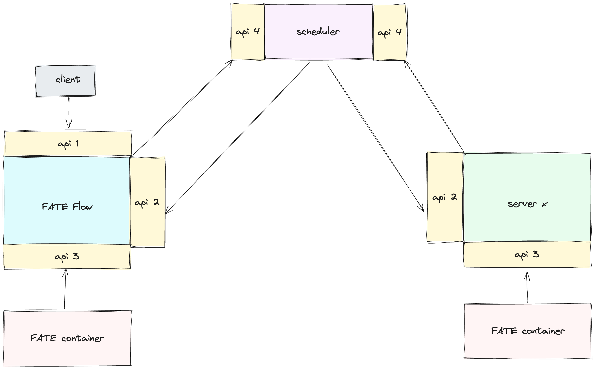
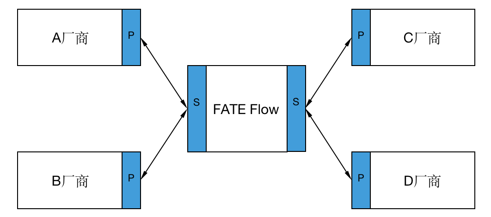
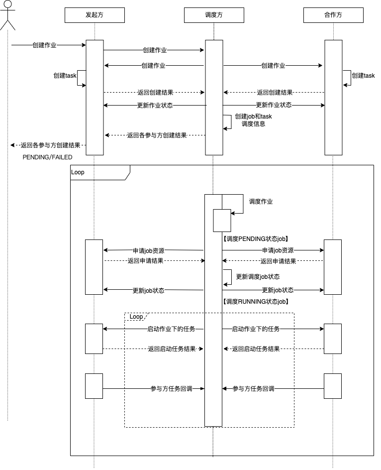
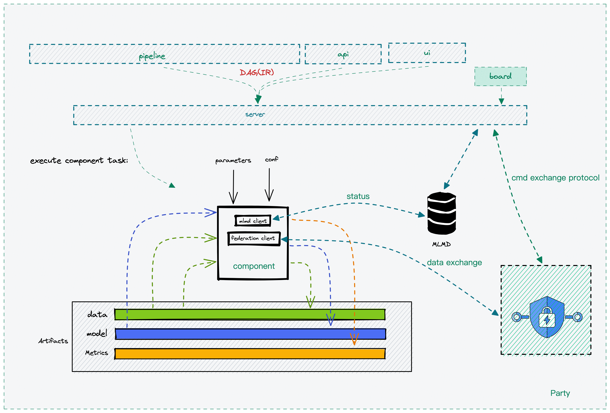

# FATE 2.0 Version Interconnection Guide

## 1. FATE Flow Integration Guide
- Description: This section provides guidance on integrating heterogeneous scheduling platforms with the FATE scheduling platform's FATE Flow.
- Scenario: This side is the system to be integrated, and the partner is the FATE site.

### 1.1 Interfaces

FATE Flow interfaces are divided into 4 categories:
- 1.responsible for receiving requests from upper-level systems, such as submitting, stopping, and querying jobs;
- 2.responsible for receiving requests from the scheduling layer, such as starting and stopping tasks;
- 3.responsible for receiving requests from algorithm containers, such as task status, input reporting, etc.;
- 4.responsible for receiving requests from the platform layer and distributing them to the interfaces of the participating parties.

#### 1.1.1 api-1
Description: Since it is about integrating with the upper-level system and does not involve interaction between schedulers, this interface is optional and can be customized without constraints.

#### 1.1.2 api-2
Refer to [interface](./../python/fate_flow/apps/partner/partner_app.py) implementation
- `/v2/partner/job/create`: Create a job
- `/v2/partner/job/start`: Start a job
- `/v2/partner/job/status/update`: Update job status
- `/v2/partner/job/update`: Update job (e.g., progress information)
- `/v2/partner/job/resource/apply`: Apply for job resources
- `/v2/partner/job/resource/return`: Return job resources
- `/v2/partner/job/stop`: Stop job
- `/v2/partner/task/resource/apply`: Apply for task resources
- `/v2/partner/task/resource/return`: Return task resources
- `/v2/partner/task/start`: Start task
- `/v2/partner/task/collect`: Scheduler collects task status
- `/v2/partner/task/status/update`: Update task status
- `/v2/partner/task/stop`: Stop task
- `/v2/partner/task/rerun`: Rerun task

#### 1.1.3 api-3
Refer to [interface](./../python/fate_flow/apps/worker/worker_app.py) implementation
- `/v2/worker/task/status`: Status report
- `/v2/worker/model/save`: Save model
- `/v2/worker/model/download`: Download model
- `/v2/worker/data/tracking/query`: Query data
- `/v2/worker/data/tracking/save`: Record data
- `/v2/worker/metric/save/<execution_id>`: Record metrics

#### 1.1.4 api-4
Refer to [interface](./../python/fate_flow/apps/scheduler/scheduler_app.py) implementation
- `/v2/scheduler/job/create`: Create a job
- `/v2/scheduler/job/stop`: Stop a job
- `/v2/scheduler/task/report`: Task report (e.g., status)
- `/v2/scheduler/job/rerun`: Rerun a job

### 1.2 Scheduler
The scheduler mainly consists of two parts: scheduling logic and scheduling interface. In the case of interconnection in a heterogeneous scenario, a unified scheduling process and interface are indispensable. In the case mentioned above, when using FATE Flow as the scheduling party in connection with other vendors, the implementation of the scheduler can be ignored.

#### 1.2.1 Approach
The core of scheduling is the scheduling process, which defines the lifecycle of a job. In version 1.x of FATE, the scheduler and the initiator logic are bound, meaning the coordination scheduling of jobs from multiple parties is done at the initiator. This has a disadvantage: suppose companies A, B, and C each have the need to initiate tasks, their scheduling layers need to implement the scheduler based on the same scheduling logic, and the cost of interconnection is high. In version 2.0, the initiator and scheduler logic in the scheduling module are decoupled, and the scheduler can be specified in the job configuration. In the above case, as long as any one of A, B, or C companies implements the scheduler, or directly uses FATE as the scheduler, other vendors only need to implement the scheduler client interface to meet the requirements, greatly reducing the cost of interconnection.


<p style="text-align:center;">P represents the scheduling client interface, S represents the scheduler interface</p>


To illustrate this scheduling mode with an example: Suppose A wants to create a job with C, and FATE Flow is the scheduler. First, A requests the FATE-Flow S (create-job) interface. After receiving the request, FATE Flow obtains participant information (A, C) through job configuration, and then distributes it to the P (create-job) interface of each participant.

#### 1.2.2 Scheduling Logic
It manages the lifecycle of jobs, including when to start and stop jobs, when to start and stop tasks, DAG parsing, and component runtime dependencies, etc. FATE Flow's scheduling process is divided into two modes based on task status acquisition: callback and poll. Among them, the callback mode is for the participants to actively report task status to the scheduler, and the poll mode is for the scheduler to pull task status from the participants at regular intervals. The scheduling process diagrams for the two modes are as follows:


<p style="text-align:center;">Callback Mode</p>


<p style="text-align:center;">Poll Mode</p>


#### 1.2.3 Scheduling Interface
Responsible for receiving requests from the platform layer and distributing them to the interfaces of various participants [api-2](#api-2), such as creating jobs, stopping jobs, etc. Interfaces see [api-4](#api-4)


## 2 Algorithm Integration Guide
In previous versions of FATE, algorithms ran as local processes started by the scheduling service, and there were shortcomings in terms of scalability, making it difficult to meet the needs of interconnection. In version 2.0, the "algorithm container" is used to run algorithms, implementing heterogeneous algorithm scheduling functionality through a standardized algorithm image construction and loading mechanism.


### 2.1 FATE Algorithm Containerization Solution
- Pre-processing: Input processing for data, models, algorithm parameters, etc., will call the platform-layer interface [api-3](#api-3) to obtain relevant dependencies.
- Component runtime: Algorithm component logic.
- Post-processing: Output content processing for algorithm components, will call the platform-layer interface [api-3](#api-3) to upload the output to the platform.


### 2.2 Integration
#### 2.2.1 Algorithm Parameters
FATE Flow will pass parameters to the algorithm container in the form of environment variables, with the key being "CONFIG" and the parameter value being a JSON string. The content is as follows:
```
component: psi
computing_partitions: 8
conf:
  computing:
    metadata:
      computing_id: 202402271112016150790_psi_0_0_host_9998
      host：127.0.0.1
      port:4670
    type: standalone/eggroll/spark
  device:
    metadata: {}
    type: CPU
  federation:
    metadata:
      federation_id: 202402271112016150790_psi_0_0
      parties:
        local:
          partyid: '9998'
          role: host
        parties:
        - partyid: '9999'
          role: guest
        - partyid: '9998'
          role: host
      osx_config:
        host: 127.0.01
        port: 9370
    type: osx
  logger:
    config:
  storage: standalone/eggroll/hdfs
engine_run:
  cores: 4
input_artifacts:
  data:
    input_data:
      output_artifact_key: output_data
      output_artifact_type_alias: null
      parties:
      - party_id:
        - '9998'
        role: host
      producer_task: reader_0
  model: null
job_id: '202402271112016150790'
launcher_conf: {}
launcher_name: default
mlmd:
  metadata:
    api_version: v2
    host: 127.0.0.1
    port: 9380
    protocol: http
  type: flow
model_id: '202402271112016150790'
model_version: '0'
parameters: {}
party_id: '9998'
party_task_id: 202402271112016150790_psi_0_0_host_9998
provider_name: fate
role: host
stage: default
task_id: 202402271112016150790_psi_0
task_name: psi_0
task_version: '0'
```
Here are the key configurations:
- `component`: The name of the algorithm. When multiple algorithms are packaged in the same image, this parameter is used to identify them.
- `conf.computing`: Configuration for the computing engine.
- `conf.federation`: Configuration for the communication engine.
- `conf.storage`: Configuration for the storage engine, supporting standalone/eggroll and hdfs.
- `mlmd`: Platform-layer interface used for recording the output of the algorithm. The interface is [api-3](#api-3).
- `input_artifacts`: Input dependencies, including data, models, etc.
- `parameters`: Algorithm parameters.
The entry point for starting the algorithm needs to be specified with CMD when building the image, and the algorithm should call the status reporting interface in [api-3](#api-3) upon completion.


#### 2.2.2 Registering Algorithm Image
```shell
flow provider register -c examples/provider/register_image.json
```
Where `register_image.json` looks like this:
```json
{
  "name": "fate",
  "device": "docker",
  "version": "2.1.0",
  "metadata": {
    "base_url": "",
    "image": "federatedai/fate:2.1.0"
  }
}
```

#### 2.2.3 Using Algorithm Image
After registration, in the DAG of the job configuration, you can specify the provider to run this FATE algorithm image, as shown below:
```yaml
dag:
  conf:
    task:
      provider: fate:2.1.0@docker
```
Alternatively, you can specify this image for a specific algorithm. For details, refer to the [provider guide](./provider_register.md).