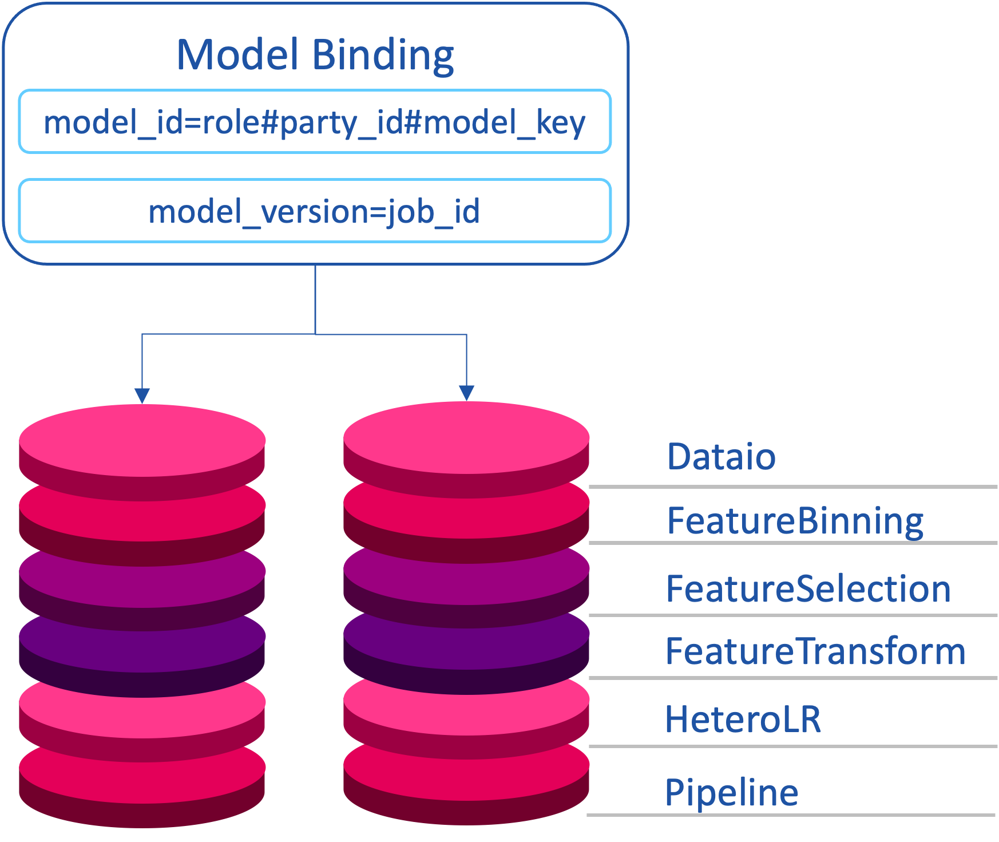

# Overall Design

## 1. Logical Architecture

- DSL defined jobs
- Top-down vertical subtask flow scheduling, multi-participant joint subtask coordination
- Independent isolated task execution work processes
- Support for multiple types and versions of components
- Computational abstraction API
- Storage abstraction API
- Cross-party transfer abstraction API

## 2. Service Architecture

### 2.1 FATE

### 2.2 FATE Flow

## 3. [Scheduling Architecture](./fate_flow_job_scheduling.md)

### 3.1 A new scheduling architecture based on shared-state

- Stripping state (resources, jobs) and managers (schedulers, resource managers)
- Resource state and job state are persisted in MySQL and shared globally to provide reliable transactional operations
- Improve the high availability and scalability of managed services
- Jobs can be intervened to support restart, rerun, parallel control, resource isolation, etc.

### 3.2 State-Driven Scheduling

- Resource coordination
- Pull up the child process Executor to run the component
- Executor reports state to local Server and also to scheduler
- Multi-party task state calculation of federal task state
- Upstream and downstream task states compute job states

## 4. [Multiparty Resource Coordination](./fate_flow_resource_management.md)

- The total resource size of each engine is configured through the configuration file, and the system is subsequently interfaced
- The cores_per_node in the total resource size indicates the number of cpu cores per compute node, and nodes indicates the number of compute nodes.
- FATEFlow server reads the resource size configuration from the configuration file when it starts and registers the update to the database
- The resources are requested in Job dimension, and take effect when Job Conf is submitted, formula: task_parallelism*task_cores
- See separate section of the documentation for details

## 5. [Data Flow Tracking](./fate_flow_tracking.md)

- Definition
 - metric type: metric type, such as auc, loss, ks, etc.
 - metric namespace: custom metric namespace, e.g. train, predict
 - metric name: custom metric name, e.g. auc0, hetero_lr_auc0
 - metric data: metric data in key-value form
 - metric meta: metric meta information in key-value form, support flexible drawing
- API
 - log_metric_data(metric_namespace, metric_name, metrics)
 - set_metric_meta(metric_namespace, metric_name, metric_meta)
 - get_metric_data(metric_namespace, metric_name)
 - get_metric_meta(metric_namespace, metric_name)

## 6. [Realtime Monitoring](./fate_flow_monitoring.md)

- Job process survivability detection
- Job timeout detection
- Resource recovery detection
- Base engine session timeout detection

## 7. [Task Component Registry](./fate_flow_component_registry.md)

## 8. [Multi-Party Federated Model Registry](./fate_flow_model_registry.md)

- Using Google Protocol Buffer as the model storage protocol, using cross-language sharing, each algorithmic model consists of two parts: ModelParam & ModelMeta
- A Pipeline generates a series of algorithmic models
- The model named Pipeline stores Pipeline modeling DSL and online inference DSL
- Under federal learning, model consistency needs to be guaranteed for all participants, i.e., model binding
- model_key is the model identifier defined by the user when submitting the task
- The model IDs of the federated parties are the party identification information role, party_id, plus model_key
- The model version of the federated parties must be unique and consistent, and FATE-Flow directly sets it to job_id

{: style="height:400px;width:450px"}

{: style="height:400px;width:800px"}

## 9. [Data Access](./fate_flow_data_access.md)

- Upload.
 - External storage is imported directly to FATE Storage, creating a new DTable
 - When the job runs, Reader reads directly from Storage

- Table Bind.
 - Key the external storage address to a new DTable in FATE
 - When the job is running, Reader reads data from external storage via Meta and transfers it to FATE Storage
 - Connecting to the Big Data ecosystem: HDFS, Hive/MySQL

## 10. [Multi-Party Collaboration Authority Management](./fate_flow_authority_management.md)

