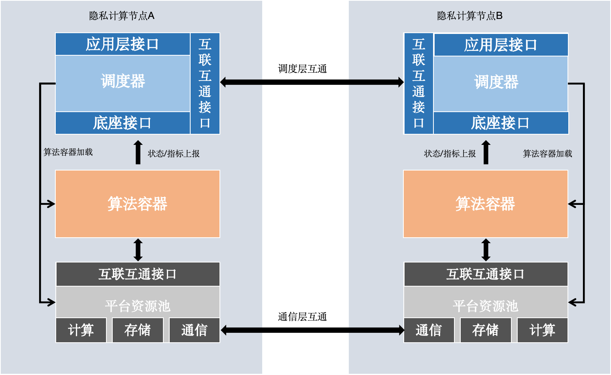
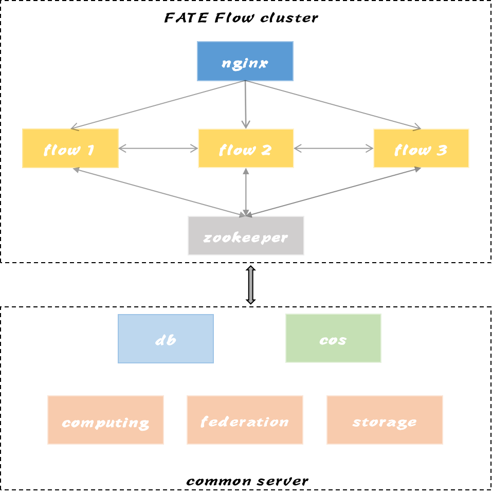
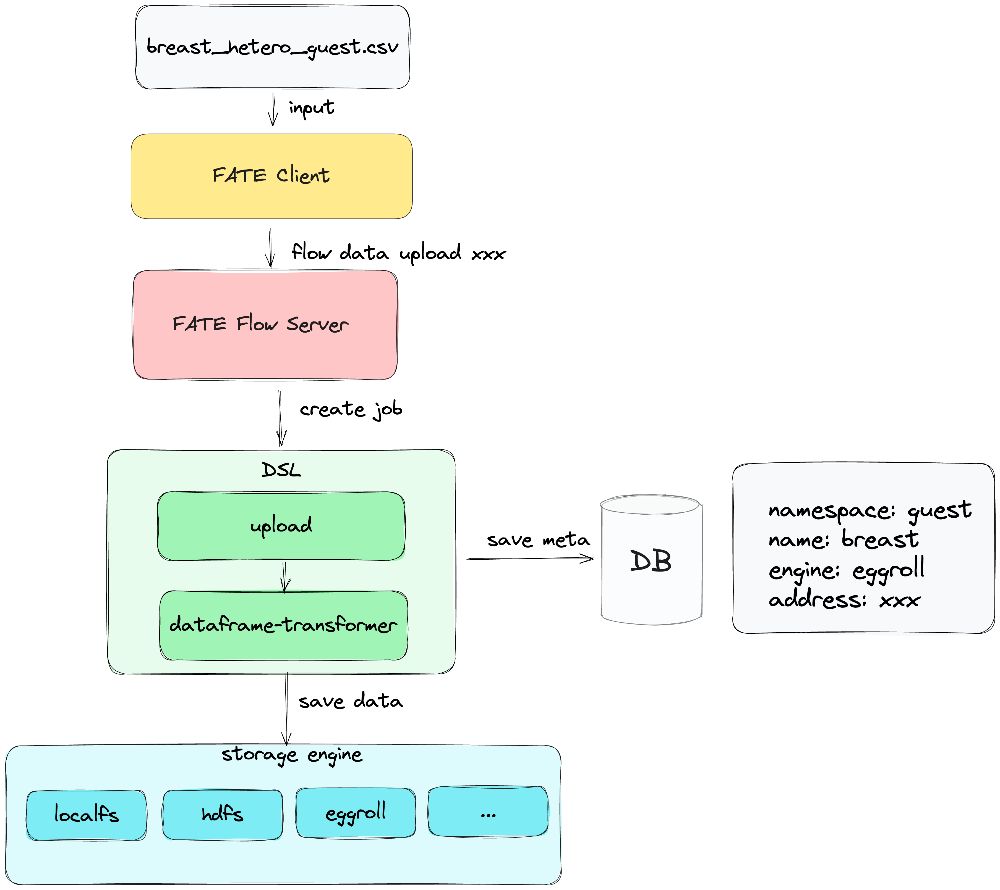

# 整体设计

## 1. 设计架构图

- 应用层接口：供如fate-board、fate-client等上层使用
- 互联互通层接口：分为调度器接口和参与方接口，调度器接口用于接收如创建、停止等调度命令并下发给参与方，参与方接口用于各参与方接收如创建、运行、停止等命令并执行
- 底座接口： 用于接收算法容器上报的状态等
- 调度器：联邦调度逻辑，解析DSL依赖及运行相关的作业及任务
- 算法容器：是算法运行的环境，FATE Flow支持算法运行在本地进程、算法容器中，其运行方式类似。
- 平台资源池： 抽象计算、通信、存储API

## 2. 整体架构

### 2.1 FATE整体架构

### 2.2 FATE Flow功能架构

### 2.3 FATE Flow集群架构

## 3. 调度架构
### 3.1 基于共享状态的调度架构

- 剥离状态(资源、作业)与管理器(调度器、资源管理器)
- 资源状态与作业状态持久化存于MySQL，全局共享，提供可靠事务性操作
- 提高管理服务的高可用与扩展性
- 作业可介入，支持实现如重启、重跑、并行控制、资源隔离等

### 3.2 状态驱动调度

- 南北向状态上报/查询
- 东西向多方任务状态计算联邦任务状态
- 上下游任务状态计算作业作态
#### 3.2.1 callback回调模式
调度器创建作业和任务，由各参与方主动回调作业或任务的状态

#### 3.2.2 poll轮询模式
调度器不仅需创建作业和任务，在调度过程中会轮询参与方的作业或任务的状态

### 3.4 算法组件调度
- 前处理: 数据、模型、算法参数等输入处理
- 组件运行: 算法组件逻辑
- 后处理: 算法组件输出内容处理

## 4. 多方资源协调

- 每个引擎总资源大小通过配置文件配置，后续实现系统对接
- 总资源大小中的cores表示每个计算节点cpu核数
- FATEFlow server启动时从配置文件读取资源大小配置，并注册更新到数据库
- 以Job维度申请资源，Job Conf提交时生效

## 5. 作业实时监测

- 工作进程存活性检测
- 作业超时检测
- 资源回收检测
- 基础引擎会话超时检测

## 6. [任务组件中心](./provider_register.zh.md)

## 7. [数据接入](./data_access.zh.md)

