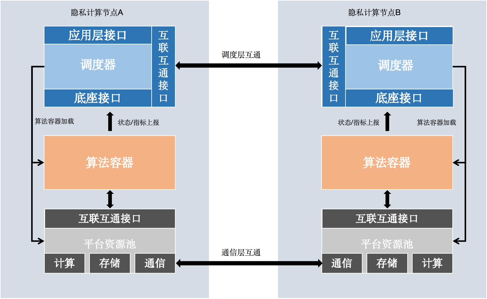
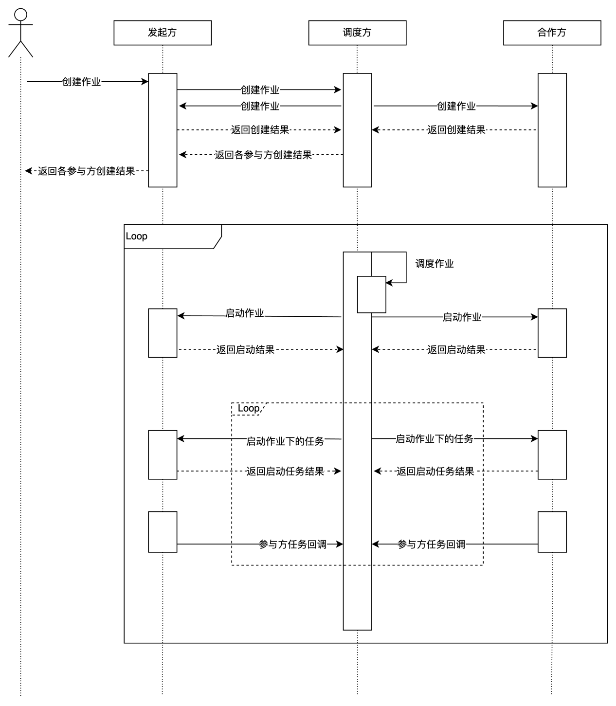

## FATE FLOW V2.0方案

### 1. 背景

联邦学习为打破“数据孤岛”而生，然而随着越来越多的机构投身到联邦学习领域，不同架构的联邦学习系统之间逐渐形成了新的“孤岛”现象，互联互通显得越发重要。FATE FLow 2.0版本将定义全新的Open Flow Api，从流程调度和算法调度两个层面实现互联互通。

### 2. 整体方案图

### 3. 调度层

#### 3.1 流程调度时序图

2.x版本调度方可在任务配置中指定(默认为发起方)，可以为发起方、合作方或者第三方。

##### 3.1.1 push模式
说明：各参与方主动上报任务状态

##### 3.1.2 pull模式
说明：调度方定时查询各参与方任务状态

#### 3.2 应用层

- 说明：用于对接上层系统，包括任务创建、查询、停止等接口

#### 3.3 底座层

- 说明：用于对接算法容器，包括任务状态上报、任务输出存储/查询等

#### 3.4 互联互通层

- 说明：用于对接跨机构、站点调度

### 4. 算法容器调度

说明：FATE历史版本中的算法加载是以python脚本形式在subprocess进程中加载，在安全性、扩展性等方面存在不足，且无法满足异构算法组合编排场景。在新版本中引入“算法容器”加载算法，通过制定统一的算法镜像构建标准与接口并定义一套规范的镜像加载机制与流程，实现异构场景的互联互通。

注：图中节点A、B代表两家隐私计算提供商，A-X代表A厂的算法X，B-Y代表B厂算法Y。

#### 4.1 容器注册与加载

- [算法容器注册与加载文档](./container.md)

#### 4.2 平台资源

##### 4.2.1 通信
新增支持osx(open site exchange)作为通信服务
- 调度通信服务：rollsite、nginx、osx
- 算法通信服务：rollsite、rabbitmq、pulsar、osx

##### 4.2.2 计算

- standalone
- eggroll
- spark

##### 4.2.3 存储

- standalone
- eggroll
- hdfs
- ...

### 5. DAG定义
fate 2.0参考kubeflow的设计，在DAG的结构定义方面进行调整，具体参考: [新版dag配置](./../examples/lr/eggroll/lr_train_dag.yaml)

### 6. 解耦

fate 1.x版本的调度层与算法层在数据、模型、类调用等方面存在一些耦合和特判的情况。在fate 2.0版本，在算法和调度层面解偶，以此降低异构算法接入的开发成本。

### 7. 资源管控
- 资源类型: job、 task
- 管控粒度: job级资源控制任务数量、task级资源控制任务并行度

### 8. 状态码定义
- 细化api状态码，以便快速定位问题
