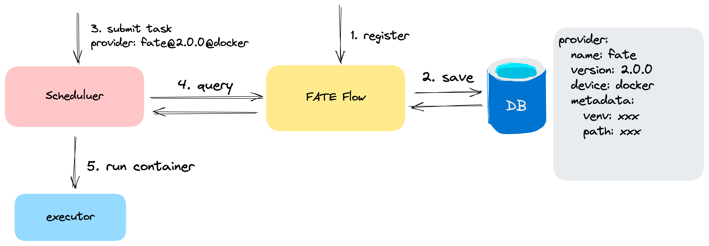

# 组件注册中心

## 1. 说明
FATE Flow设计了算法组件注册模块，以支持多个算法开发厂商、多个版本及多种运行模式。

## 2. provider
*定义*： `$name:$version@device`, 如`fate:2.0.0@local`
- name： 算法提供厂商
- version: 算法版本
- device: 算法运行模式，如: docker, k8s, local等

### 2.1 注册
- 注册命令：

```shell
flow provider register -c examples/provider/register.json
```
- 注册本地的算法包，需要传入算法包路径(path)和python环境路径(可选，若不传将使用系统的环境)
```json
{
  "name": "fate",
  "device": "local",
  "version": "2.0.1",
  "metadata": {
    "path": "/Users/tonly/FATE/python",
    "venv": "/Users/tonly/opt/anaconda3/envs/fate3.8/bin/python"
  }
}
```

- 注册docker算法镜像包
```json
{
  "name": "fate",
  "device": "docker",
  "version": "2.0.0",
  "metadata": {
    "base_url": "",
    "image": "federatedai/fate:2.0.0"
  },
  "protocol": "bfia",
  "components_description": {}
}
``` 

### 2.2 查询

- 命令：
```shell
flow provider register --name fate --version 2.0.1 --device local
```
- 输出：
```json
{
    "code": 0,
    "data": [
        {
            "create_time": 1703762542058,
            "device": "local",
            "metadata": {
                "path": "/Users/tonly/FATE/python",
                "venv": "/Users/tonly/opt/anaconda3/envs/fate3.8/bin/python"
            },
            "name": "fate",
            "provider_name": "fate:2.0.1@local",
            "update_time": 1703762542058,
            "version": "2.0.1"
        }
    ],
    "message": "success"
}

```

### 2.3 删除
用于删除已经注册的算法
- 命令：
```shell
flow provider delete --name fate --version 2.0.1 --device local
```
- 输出：
```json
{
    "code": 0,
    "data": true,
    "message": "success"
}
```

### 3.组件注册与发现机制
- 注册算法
- 任务配置中携带provider参数，详见如下[配置方法](#配置方法)



### 4. 配置方法
### 4.1 全局job配置
```yaml
dag:
  conf:
    task:
      provider: fate:2.0.1@local
```
job下的所有task继承此provider

### 4.2 全局参与方task配置
```yaml
dag:
  party_tasks:
    guest_9999:
      parties:
      - party_id:
        - '9999'
        role: guest
      conf:
        provider: fate:2.0.1@local
```
guest 9999下的所有task继承此provider

### 4.3 全局task配置
```yaml
dag:
  tasks:
    reader_0:
      conf:
        provider: fate:2.0.1@local
      component_ref: reader
```
所有参与方的reader组件继承此provider

### 4.4 指定task配置
```yaml
dag:
  party_tasks:
    guest_9999:
      parties:
      - party_id:
        - '9999'
        role: guest
      tasks:
        reader_0:
          conf:
            provider: fate:2.0.1@local
```
guest 9999下reader组件继承此provider
